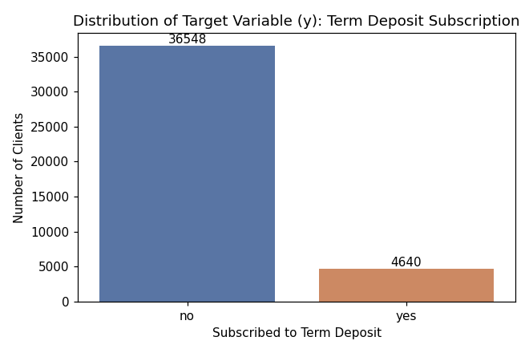
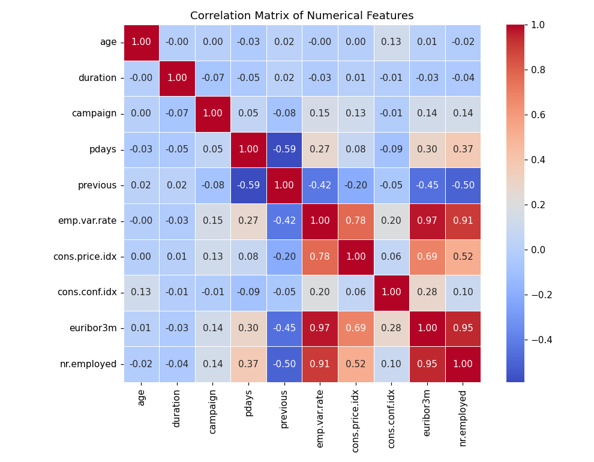

# Bank Marketing Data Analysis 📊

An exploratory data analysis (EDA) of a Portuguese bank's direct marketing campaign data, completed as part of my **Skillified internship data analysis task**. The goal is to understand customer demographics and campaign patterns, and to inspect the data as a foundation for predicting whether a client will subscribe to a term deposit.

## 📁 Repository Structure

```
├── Bank_Marketing_Inspection_test.ipynb   # Main analysis notebook (with outputs)
├── bankmarketing.csv                      # Dataset used in the analysis
├── screenshots/                           # Key visualizations from the notebook
│   ├── target_dist.png
│   └── corr_matrix.png
└── README.md
```

## 📌 About the Dataset

The dataset contains **41,188 records** and **21 columns** collected from a bank's telemarketing campaigns, including:

- **Client demographics:** age, job, marital status, education
- **Financial info:** default, housing loan, personal loan status
- **Campaign details:** contact type, month, day of week, call duration, number of contacts
- **Previous campaign outcomes:** pdays, previous contacts, poutcome
- **Macroeconomic indicators:** employment variation rate, consumer price/confidence index, euribor rate, number of employees
- **Target variable (`y`):** whether the client subscribed to a term deposit (`yes`/`no`)

## 🔍 What the Notebook Covers

1. **Data loading & preview** — loading the CSV and inspecting the first few rows
2. **Data quality check** — data types and missing value inspection
3. **Summary statistics** — descriptive statistics for all numerical features
4. **Target variable distribution** — visualizing the class balance of subscribers vs. non-subscribers
5. **Correlation analysis** — a heatmap of numerical feature correlations to spot multicollinearity

## 📈 Key Findings

- The dataset is **clean**, with no missing values across any of the 21 columns.
- The target variable is **imbalanced**: only ~11.3% of clients (4,640) subscribed to a term deposit, versus ~88.7% (36,548) who did not.
- Several macroeconomic indicators (`emp.var.rate`, `euribor3m`, `nr.employed`, `cons.price.idx`) are **highly correlated** with each other, which is important to account for in future feature selection or modeling.

### Target Variable Distribution


### Correlation Matrix


## 🛠️ Tools Used

- Python
- Pandas
- Seaborn / Matplotlib
- Jupyter Notebook

## 🚀 How to Run

1. Clone this repository
2. Install dependencies: `pip install pandas seaborn matplotlib`
3. Open `Bank_Marketing_Inspection_test.ipynb` in Jupyter Notebook or Google Colab
4. Run all cells

## 🎯 Next Steps

This inspection lays the groundwork for a full predictive modeling workflow — including handling class imbalance, encoding categorical features, and training classification models to predict term deposit subscription.

---
*This project was completed as part of a data analysis internship task with Skillified.*
